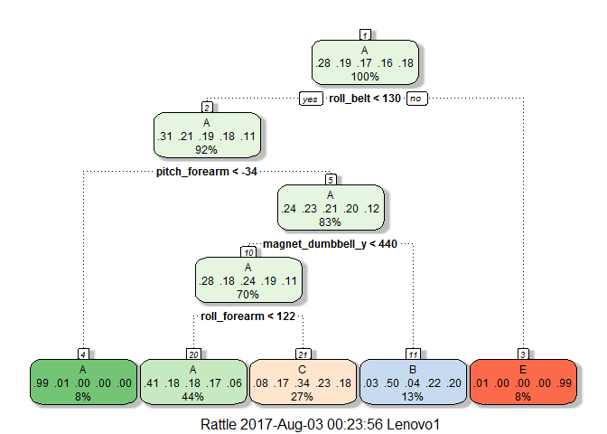
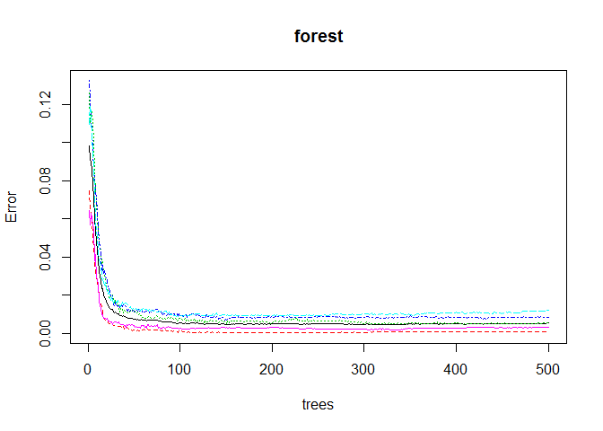
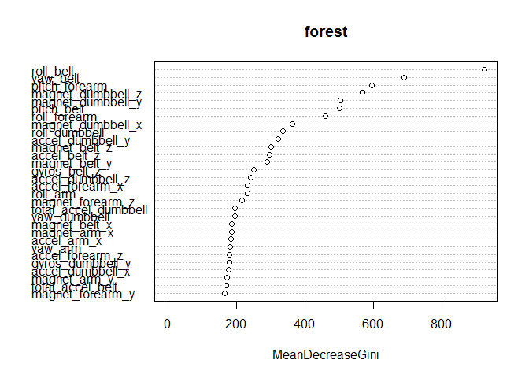

# Practical Machine Learning Course Project - Human Activity Recognition
Nanda kumar Sathiyamoorthy  
August 2, 2017  


# Background

Using devices such as Jawbone Up, Nike FuelBand, and Fitbit it is now possible to collect a large amount of data about personal activity relatively inexpensively. These type of devices are part of the quantified self movement - a group of enthusiasts who take measurements about themselves regularly to improve their health, to find patterns in their behavior, or because they are tech geeks. One thing that people regularly do is quantify how much of a particular activity they do, but they rarely quantify how well they do it. In this analysis, our goal will be to use data from accelerometers on the belt, forearm, arm, and dumbell of 6 participants. They were asked to perform barbell lifts correctly and incorrectly in 5 different ways. More information is available from the website here: http://groupware.les.inf.puc-rio.br/har (see the section on the Weight Lifting Exercise Dataset). 

## Data

The training data for this project are available here:

https://d396qusza40orc.cloudfront.net/predmachlearn/pml-training.csv

The test data are available here:

https://d396qusza40orc.cloudfront.net/predmachlearn/pml-testing.csv


# Exploratory Analysis


```r
# Load necessary packages
library(RCurl)
library(caret)
library(rattle)
library(parallel)
library(doParallel)
library(randomForest)
library(ROCR)
```


```r
# Read the training and test data using the corresponding URLs
url_train = getURL("https://d396qusza40orc.cloudfront.net/predmachlearn/pml-training.csv")
df = read.csv(textConnection(url_train))

url_test = getURL("https://d396qusza40orc.cloudfront.net/predmachlearn/pml-testing.csv")
test = read.csv(textConnection(url_test))
```

Now, let us look at the data and try to understand its structure
        

```r
# Look at the dimensions of the data
dim(df)
```

```
## [1] 19622   160
```

```r
# Look at the first few lines of the data
head(df)
```

```
##   X user_name raw_timestamp_part_1 raw_timestamp_part_2   cvtd_timestamp
## 1 1  carlitos           1323084231               788290 05/12/2011 11:23
## 2 2  carlitos           1323084231               808298 05/12/2011 11:23
## 3 3  carlitos           1323084231               820366 05/12/2011 11:23
## 4 4  carlitos           1323084232               120339 05/12/2011 11:23
## 5 5  carlitos           1323084232               196328 05/12/2011 11:23
## 6 6  carlitos           1323084232               304277 05/12/2011 11:23
##   new_window num_window roll_belt pitch_belt yaw_belt total_accel_belt
## 1         no         11      1.41       8.07    -94.4                3
## 2         no         11      1.41       8.07    -94.4                3
## 3         no         11      1.42       8.07    -94.4                3
## 4         no         12      1.48       8.05    -94.4                3
## 5         no         12      1.48       8.07    -94.4                3
## 6         no         12      1.45       8.06    -94.4                3
##   kurtosis_roll_belt kurtosis_picth_belt kurtosis_yaw_belt
## 1                                                         
## 2                                                         
## 3                                                         
## 4                                                         
## 5                                                         
## 6                                                         
##   skewness_roll_belt skewness_roll_belt.1 skewness_yaw_belt max_roll_belt
## 1                                                                      NA
## 2                                                                      NA
## 3                                                                      NA
## 4                                                                      NA
## 5                                                                      NA
## 6                                                                      NA
##   max_picth_belt max_yaw_belt min_roll_belt min_pitch_belt min_yaw_belt
## 1             NA                         NA             NA             
## 2             NA                         NA             NA             
## 3             NA                         NA             NA             
## 4             NA                         NA             NA             
## 5             NA                         NA             NA             
## 6             NA                         NA             NA             
##   amplitude_roll_belt amplitude_pitch_belt amplitude_yaw_belt
## 1                  NA                   NA                   
## 2                  NA                   NA                   
## 3                  NA                   NA                   
## 4                  NA                   NA                   
## 5                  NA                   NA                   
## 6                  NA                   NA                   
##   var_total_accel_belt avg_roll_belt stddev_roll_belt var_roll_belt
## 1                   NA            NA               NA            NA
## 2                   NA            NA               NA            NA
## 3                   NA            NA               NA            NA
## 4                   NA            NA               NA            NA
## 5                   NA            NA               NA            NA
## 6                   NA            NA               NA            NA
##   avg_pitch_belt stddev_pitch_belt var_pitch_belt avg_yaw_belt
## 1             NA                NA             NA           NA
## 2             NA                NA             NA           NA
## 3             NA                NA             NA           NA
## 4             NA                NA             NA           NA
## 5             NA                NA             NA           NA
## 6             NA                NA             NA           NA
##   stddev_yaw_belt var_yaw_belt gyros_belt_x gyros_belt_y gyros_belt_z
## 1              NA           NA         0.00         0.00        -0.02
## 2              NA           NA         0.02         0.00        -0.02
## 3              NA           NA         0.00         0.00        -0.02
## 4              NA           NA         0.02         0.00        -0.03
## 5              NA           NA         0.02         0.02        -0.02
## 6              NA           NA         0.02         0.00        -0.02
##   accel_belt_x accel_belt_y accel_belt_z magnet_belt_x magnet_belt_y
## 1          -21            4           22            -3           599
## 2          -22            4           22            -7           608
## 3          -20            5           23            -2           600
## 4          -22            3           21            -6           604
## 5          -21            2           24            -6           600
## 6          -21            4           21             0           603
##   magnet_belt_z roll_arm pitch_arm yaw_arm total_accel_arm var_accel_arm
## 1          -313     -128      22.5    -161              34            NA
## 2          -311     -128      22.5    -161              34            NA
## 3          -305     -128      22.5    -161              34            NA
## 4          -310     -128      22.1    -161              34            NA
## 5          -302     -128      22.1    -161              34            NA
## 6          -312     -128      22.0    -161              34            NA
##   avg_roll_arm stddev_roll_arm var_roll_arm avg_pitch_arm stddev_pitch_arm
## 1           NA              NA           NA            NA               NA
## 2           NA              NA           NA            NA               NA
## 3           NA              NA           NA            NA               NA
## 4           NA              NA           NA            NA               NA
## 5           NA              NA           NA            NA               NA
## 6           NA              NA           NA            NA               NA
##   var_pitch_arm avg_yaw_arm stddev_yaw_arm var_yaw_arm gyros_arm_x
## 1            NA          NA             NA          NA        0.00
## 2            NA          NA             NA          NA        0.02
## 3            NA          NA             NA          NA        0.02
## 4            NA          NA             NA          NA        0.02
## 5            NA          NA             NA          NA        0.00
## 6            NA          NA             NA          NA        0.02
##   gyros_arm_y gyros_arm_z accel_arm_x accel_arm_y accel_arm_z magnet_arm_x
## 1        0.00       -0.02        -288         109        -123         -368
## 2       -0.02       -0.02        -290         110        -125         -369
## 3       -0.02       -0.02        -289         110        -126         -368
## 4       -0.03        0.02        -289         111        -123         -372
## 5       -0.03        0.00        -289         111        -123         -374
## 6       -0.03        0.00        -289         111        -122         -369
##   magnet_arm_y magnet_arm_z kurtosis_roll_arm kurtosis_picth_arm
## 1          337          516                                     
## 2          337          513                                     
## 3          344          513                                     
## 4          344          512                                     
## 5          337          506                                     
## 6          342          513                                     
##   kurtosis_yaw_arm skewness_roll_arm skewness_pitch_arm skewness_yaw_arm
## 1                                                                       
## 2                                                                       
## 3                                                                       
## 4                                                                       
## 5                                                                       
## 6                                                                       
##   max_roll_arm max_picth_arm max_yaw_arm min_roll_arm min_pitch_arm
## 1           NA            NA          NA           NA            NA
## 2           NA            NA          NA           NA            NA
## 3           NA            NA          NA           NA            NA
## 4           NA            NA          NA           NA            NA
## 5           NA            NA          NA           NA            NA
## 6           NA            NA          NA           NA            NA
##   min_yaw_arm amplitude_roll_arm amplitude_pitch_arm amplitude_yaw_arm
## 1          NA                 NA                  NA                NA
## 2          NA                 NA                  NA                NA
## 3          NA                 NA                  NA                NA
## 4          NA                 NA                  NA                NA
## 5          NA                 NA                  NA                NA
## 6          NA                 NA                  NA                NA
##   roll_dumbbell pitch_dumbbell yaw_dumbbell kurtosis_roll_dumbbell
## 1      13.05217      -70.49400    -84.87394                       
## 2      13.13074      -70.63751    -84.71065                       
## 3      12.85075      -70.27812    -85.14078                       
## 4      13.43120      -70.39379    -84.87363                       
## 5      13.37872      -70.42856    -84.85306                       
## 6      13.38246      -70.81759    -84.46500                       
##   kurtosis_picth_dumbbell kurtosis_yaw_dumbbell skewness_roll_dumbbell
## 1                                                                     
## 2                                                                     
## 3                                                                     
## 4                                                                     
## 5                                                                     
## 6                                                                     
##   skewness_pitch_dumbbell skewness_yaw_dumbbell max_roll_dumbbell
## 1                                                              NA
## 2                                                              NA
## 3                                                              NA
## 4                                                              NA
## 5                                                              NA
## 6                                                              NA
##   max_picth_dumbbell max_yaw_dumbbell min_roll_dumbbell min_pitch_dumbbell
## 1                 NA                                 NA                 NA
## 2                 NA                                 NA                 NA
## 3                 NA                                 NA                 NA
## 4                 NA                                 NA                 NA
## 5                 NA                                 NA                 NA
## 6                 NA                                 NA                 NA
##   min_yaw_dumbbell amplitude_roll_dumbbell amplitude_pitch_dumbbell
## 1                                       NA                       NA
## 2                                       NA                       NA
## 3                                       NA                       NA
## 4                                       NA                       NA
## 5                                       NA                       NA
## 6                                       NA                       NA
##   amplitude_yaw_dumbbell total_accel_dumbbell var_accel_dumbbell
## 1                                          37                 NA
## 2                                          37                 NA
## 3                                          37                 NA
## 4                                          37                 NA
## 5                                          37                 NA
## 6                                          37                 NA
##   avg_roll_dumbbell stddev_roll_dumbbell var_roll_dumbbell
## 1                NA                   NA                NA
## 2                NA                   NA                NA
## 3                NA                   NA                NA
## 4                NA                   NA                NA
## 5                NA                   NA                NA
## 6                NA                   NA                NA
##   avg_pitch_dumbbell stddev_pitch_dumbbell var_pitch_dumbbell
## 1                 NA                    NA                 NA
## 2                 NA                    NA                 NA
## 3                 NA                    NA                 NA
## 4                 NA                    NA                 NA
## 5                 NA                    NA                 NA
## 6                 NA                    NA                 NA
##   avg_yaw_dumbbell stddev_yaw_dumbbell var_yaw_dumbbell gyros_dumbbell_x
## 1               NA                  NA               NA                0
## 2               NA                  NA               NA                0
## 3               NA                  NA               NA                0
## 4               NA                  NA               NA                0
## 5               NA                  NA               NA                0
## 6               NA                  NA               NA                0
##   gyros_dumbbell_y gyros_dumbbell_z accel_dumbbell_x accel_dumbbell_y
## 1            -0.02             0.00             -234               47
## 2            -0.02             0.00             -233               47
## 3            -0.02             0.00             -232               46
## 4            -0.02            -0.02             -232               48
## 5            -0.02             0.00             -233               48
## 6            -0.02             0.00             -234               48
##   accel_dumbbell_z magnet_dumbbell_x magnet_dumbbell_y magnet_dumbbell_z
## 1             -271              -559               293               -65
## 2             -269              -555               296               -64
## 3             -270              -561               298               -63
## 4             -269              -552               303               -60
## 5             -270              -554               292               -68
## 6             -269              -558               294               -66
##   roll_forearm pitch_forearm yaw_forearm kurtosis_roll_forearm
## 1         28.4         -63.9        -153                      
## 2         28.3         -63.9        -153                      
## 3         28.3         -63.9        -152                      
## 4         28.1         -63.9        -152                      
## 5         28.0         -63.9        -152                      
## 6         27.9         -63.9        -152                      
##   kurtosis_picth_forearm kurtosis_yaw_forearm skewness_roll_forearm
## 1                                                                  
## 2                                                                  
## 3                                                                  
## 4                                                                  
## 5                                                                  
## 6                                                                  
##   skewness_pitch_forearm skewness_yaw_forearm max_roll_forearm
## 1                                                           NA
## 2                                                           NA
## 3                                                           NA
## 4                                                           NA
## 5                                                           NA
## 6                                                           NA
##   max_picth_forearm max_yaw_forearm min_roll_forearm min_pitch_forearm
## 1                NA                               NA                NA
## 2                NA                               NA                NA
## 3                NA                               NA                NA
## 4                NA                               NA                NA
## 5                NA                               NA                NA
## 6                NA                               NA                NA
##   min_yaw_forearm amplitude_roll_forearm amplitude_pitch_forearm
## 1                                     NA                      NA
## 2                                     NA                      NA
## 3                                     NA                      NA
## 4                                     NA                      NA
## 5                                     NA                      NA
## 6                                     NA                      NA
##   amplitude_yaw_forearm total_accel_forearm var_accel_forearm
## 1                                        36                NA
## 2                                        36                NA
## 3                                        36                NA
## 4                                        36                NA
## 5                                        36                NA
## 6                                        36                NA
##   avg_roll_forearm stddev_roll_forearm var_roll_forearm avg_pitch_forearm
## 1               NA                  NA               NA                NA
## 2               NA                  NA               NA                NA
## 3               NA                  NA               NA                NA
## 4               NA                  NA               NA                NA
## 5               NA                  NA               NA                NA
## 6               NA                  NA               NA                NA
##   stddev_pitch_forearm var_pitch_forearm avg_yaw_forearm
## 1                   NA                NA              NA
## 2                   NA                NA              NA
## 3                   NA                NA              NA
## 4                   NA                NA              NA
## 5                   NA                NA              NA
## 6                   NA                NA              NA
##   stddev_yaw_forearm var_yaw_forearm gyros_forearm_x gyros_forearm_y
## 1                 NA              NA            0.03            0.00
## 2                 NA              NA            0.02            0.00
## 3                 NA              NA            0.03           -0.02
## 4                 NA              NA            0.02           -0.02
## 5                 NA              NA            0.02            0.00
## 6                 NA              NA            0.02           -0.02
##   gyros_forearm_z accel_forearm_x accel_forearm_y accel_forearm_z
## 1           -0.02             192             203            -215
## 2           -0.02             192             203            -216
## 3            0.00             196             204            -213
## 4            0.00             189             206            -214
## 5           -0.02             189             206            -214
## 6           -0.03             193             203            -215
##   magnet_forearm_x magnet_forearm_y magnet_forearm_z classe
## 1              -17              654              476      A
## 2              -18              661              473      A
## 3              -18              658              469      A
## 4              -16              658              469      A
## 5              -17              655              473      A
## 6               -9              660              478      A
```

```r
# Look at the structure of the data
str(df, list.len = 10)
```

```
## 'data.frame':	19622 obs. of  160 variables:
##  $ X                       : int  1 2 3 4 5 6 7 8 9 10 ...
##  $ user_name               : Factor w/ 6 levels "adelmo","carlitos",..: 2 2 2 2 2 2 2 2 2 2 ...
##  $ raw_timestamp_part_1    : int  1323084231 1323084231 1323084231 1323084232 1323084232 1323084232 1323084232 1323084232 1323084232 1323084232 ...
##  $ raw_timestamp_part_2    : int  788290 808298 820366 120339 196328 304277 368296 440390 484323 484434 ...
##  $ cvtd_timestamp          : Factor w/ 20 levels "02/12/2011 13:32",..: 9 9 9 9 9 9 9 9 9 9 ...
##  $ new_window              : Factor w/ 2 levels "no","yes": 1 1 1 1 1 1 1 1 1 1 ...
##  $ num_window              : int  11 11 11 12 12 12 12 12 12 12 ...
##  $ roll_belt               : num  1.41 1.41 1.42 1.48 1.48 1.45 1.42 1.42 1.43 1.45 ...
##  $ pitch_belt              : num  8.07 8.07 8.07 8.05 8.07 8.06 8.09 8.13 8.16 8.17 ...
##  $ yaw_belt                : num  -94.4 -94.4 -94.4 -94.4 -94.4 -94.4 -94.4 -94.4 -94.4 -94.4 ...
##   [list output truncated]
```

```r
# Look at the classes of outcome variable
table(df$classe)
```

```
## 
##    A    B    C    D    E 
## 5580 3797 3422 3216 3607
```

Set the seed for reproducibility and split the training data such that 3/4th of the data is used for training the models and rest 1/4th is used for cross-validation.


```r
# Set random seed
set.seed(123)

# Split the training data for cross-validation
intrain = createDataPartition(y = df$classe, p = 0.75, list = FALSE)
train = df[intrain, ]
cv = df[-intrain, ]
```

On further exploration we find that the variables fall into two categories - ones with no NA values and ones with a lot of NAs. 


```r
# Find the number of NA's for each column of the data frame
table(colSums(is.na(train)))
```

```
## 
##     0 14405 
##    93    67
```

Variables under the latter case needs to be removed as they would provide significant contribution for prediction.


```r
# Remove the columns with NA's in them
train = subset(train, select = subset(names(train),colSums(is.na(train)) == 0))
```

Looking at the first 7 variables, we find that they are actually not relevant for predicting the outcome and we will remove them from the data set.


```r
names(train)[1:10]
```

```
##  [1] "X"                    "user_name"            "raw_timestamp_part_1"
##  [4] "raw_timestamp_part_2" "cvtd_timestamp"       "new_window"          
##  [7] "num_window"           "roll_belt"            "pitch_belt"          
## [10] "yaw_belt"
```

```r
train = subset(train, select = -c(1:7))
```

Next, we will remove the variables with near zero variance which would be insignificant for building our models.


```r
# Remove the variables with near zero variance
zeroVar = nearZeroVar(train, saveMetrics = TRUE)
train = train[,zeroVar$nzv == FALSE]

# Ensure that the same columns are present in all the data sets.
cv = cv[, names(cv) %in% names(train)]
test = test[, names(test) %in% names(train)]
```

# Developing models


## Trees :

First, we create decision trees to fit our data and look at its salient parameters.


```r
set.seed(123)
# Build a decision tree using the training set
tree = train(classe ~ ., method = "rpart", data = train)
```

```
## Loading required package: rpart
```

```r
print(tree)
```

```
## CART 
## 
## 14718 samples
##    52 predictor
##     5 classes: 'A', 'B', 'C', 'D', 'E' 
## 
## No pre-processing
## Resampling: Bootstrapped (25 reps) 
## Summary of sample sizes: 14718, 14718, 14718, 14718, 14718, 14718, ... 
## Resampling results across tuning parameters:
## 
##   cp          Accuracy   Kappa     
##   0.03588721  0.5175091  0.37420615
##   0.06098294  0.4349132  0.23890037
##   0.11535175  0.3336635  0.07387418
## 
## Accuracy was used to select the optimal model using  the largest value.
## The final value used for the model was cp = 0.03588721.
```

```r
# Plot the tree created
fancyRpartPlot(tree$finalModel)
```

<!-- -->

We now perform cross validation for this tree model by trying the predict previusly unseen data.


```r
# Predict outcome of new data
predTree = predict(tree, newdata = cv)

#Build a confusion matrix of the results
confusionMatrix(predTree, cv$classe)
```

```
## Confusion Matrix and Statistics
## 
##           Reference
## Prediction    A    B    C    D    E
##          A 1262  378  418  356  144
##          B   20  312   26  141  101
##          C  107  259  411  307  248
##          D    0    0    0    0    0
##          E    6    0    0    0  408
## 
## Overall Statistics
##                                           
##                Accuracy : 0.488           
##                  95% CI : (0.4739, 0.5021)
##     No Information Rate : 0.2845          
##     P-Value [Acc > NIR] : < 2.2e-16       
##                                           
##                   Kappa : 0.3307          
##  Mcnemar's Test P-Value : NA              
## 
## Statistics by Class:
## 
##                      Class: A Class: B Class: C Class: D Class: E
## Sensitivity            0.9047  0.32877  0.48070   0.0000  0.45283
## Specificity            0.6307  0.92718  0.77254   1.0000  0.99850
## Pos Pred Value         0.4934  0.52000  0.30856      NaN  0.98551
## Neg Pred Value         0.9433  0.85200  0.87570   0.8361  0.89020
## Prevalence             0.2845  0.19352  0.17435   0.1639  0.18373
## Detection Rate         0.2573  0.06362  0.08381   0.0000  0.08320
## Detection Prevalence   0.5216  0.12235  0.27162   0.0000  0.08442
## Balanced Accuracy      0.7677  0.62797  0.62662   0.5000  0.72567
```

As we see the accuracy of the model is very low and hence would not be very useful for prediction.

## Random Forests :

Next, we build random forests on our training set.


```r
set.seed(123)
# Build a random forest using the training set
forest = randomForest(classe ~ ., data = train)
print(forest)
```

```
## 
## Call:
##  randomForest(formula = classe ~ ., data = train) 
##                Type of random forest: classification
##                      Number of trees: 500
## No. of variables tried at each split: 7
## 
##         OOB estimate of  error rate: 0.54%
## Confusion matrix:
##      A    B    C    D    E  class.error
## A 4182    2    0    0    1 0.0007168459
## B   12 2832    4    0    0 0.0056179775
## C    0   16 2545    6    0 0.0085703155
## D    0    0   28 2383    1 0.0120232172
## E    0    0    2    7 2697 0.0033259424
```

Then we use cross validation to check the accuracy of the model.


```r
# Predict outcome of new data
predForest = predict(forest, newdata = cv)

#Build a confusion matrix of the results
cm = confusionMatrix(predForest, cv$classe)

cm
```

```
## Confusion Matrix and Statistics
## 
##           Reference
## Prediction    A    B    C    D    E
##          A 1394    1    0    0    0
##          B    1  946    8    0    0
##          C    0    2  846    9    0
##          D    0    0    1  793    1
##          E    0    0    0    2  900
## 
## Overall Statistics
##                                           
##                Accuracy : 0.9949          
##                  95% CI : (0.9925, 0.9967)
##     No Information Rate : 0.2845          
##     P-Value [Acc > NIR] : < 2.2e-16       
##                                           
##                   Kappa : 0.9936          
##  Mcnemar's Test P-Value : NA              
## 
## Statistics by Class:
## 
##                      Class: A Class: B Class: C Class: D Class: E
## Sensitivity            0.9993   0.9968   0.9895   0.9863   0.9989
## Specificity            0.9997   0.9977   0.9973   0.9995   0.9995
## Pos Pred Value         0.9993   0.9906   0.9872   0.9975   0.9978
## Neg Pred Value         0.9997   0.9992   0.9978   0.9973   0.9998
## Prevalence             0.2845   0.1935   0.1743   0.1639   0.1837
## Detection Rate         0.2843   0.1929   0.1725   0.1617   0.1835
## Detection Prevalence   0.2845   0.1947   0.1748   0.1621   0.1839
## Balanced Accuracy      0.9995   0.9973   0.9934   0.9929   0.9992
```

We find that there is a significant improvement in the accuracy compared to the decision trees.

## Boosting :

Finally, we try generalized boosting on our training set.

Since, boosting is computationally intensive we use parallelize the processby setting up the appropriate parameteres.


```r
# Set up parallelization
cluster <- makeCluster(detectCores() - 1) 
registerDoParallel(cluster)

fitControl = trainControl(method = "repeatedcv", number = 3, repeats = 2,
                          allowParallel = TRUE)

# Build a boosting model on our training data
boost = train(classe ~ ., method = "gbm", data = train, 
              trControl = fitControl, verbose = FALSE)
```

```
## Loading required package: gbm
```

```
## Loading required package: survival
```

```
## 
## Attaching package: 'survival'
```

```
## The following object is masked from 'package:caret':
## 
##     cluster
```

```
## Loading required package: splines
```

```
## Loaded gbm 2.1.3
```

```
## Loading required package: plyr
```

```r
# De-register parallel processing cluster
stopCluster(cluster)
registerDoSEQ()
```

Check the accuracy of the model through cross-validation.


```r
# Predict outcome of new data
predBoost = predict(boost, newdata = cv)

#Build a confusion matrix of the results
confusionMatrix(predBoost, cv$classe)
```

```
## Confusion Matrix and Statistics
## 
##           Reference
## Prediction    A    B    C    D    E
##          A 1378   31    0    1    4
##          B   11  899   28    5    7
##          C    5   14  814   28    2
##          D    1    5   12  758   12
##          E    0    0    1   12  876
## 
## Overall Statistics
##                                           
##                Accuracy : 0.9635          
##                  95% CI : (0.9579, 0.9686)
##     No Information Rate : 0.2845          
##     P-Value [Acc > NIR] : < 2.2e-16       
##                                           
##                   Kappa : 0.9538          
##  Mcnemar's Test P-Value : 5.834e-05       
## 
## Statistics by Class:
## 
##                      Class: A Class: B Class: C Class: D Class: E
## Sensitivity            0.9878   0.9473   0.9520   0.9428   0.9723
## Specificity            0.9897   0.9871   0.9879   0.9927   0.9968
## Pos Pred Value         0.9745   0.9463   0.9432   0.9619   0.9854
## Neg Pred Value         0.9951   0.9874   0.9899   0.9888   0.9938
## Prevalence             0.2845   0.1935   0.1743   0.1639   0.1837
## Detection Rate         0.2810   0.1833   0.1660   0.1546   0.1786
## Detection Prevalence   0.2883   0.1937   0.1760   0.1607   0.1813
## Balanced Accuracy      0.9888   0.9672   0.9700   0.9677   0.9845
```

We find that, boosting is much better than decision trees but not as good as random forest. 

Hence, we choose random forest as our final model.

# Making predictions

Finally, we use our chosen random forest model for making predictions in the test set.


```r
predict(forest, newdata = test)
```

```
##  1  2  3  4  5  6  7  8  9 10 11 12 13 14 15 16 17 18 19 20 
##  B  A  B  A  A  E  D  B  A  A  B  C  B  A  E  E  A  B  B  B 
## Levels: A B C D E
```

We make some plots to look at the error rates and significant variables in our random forest model.


```r
plot(forest)
```

<!-- -->

```r
# This plot shows the most signifiant variables in our model
varImpPlot(forest)
```

<!-- -->

Out of sample error rate for this model is (1 - Accuracy) = 0.0050979 or 0.5097879 %


